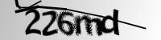
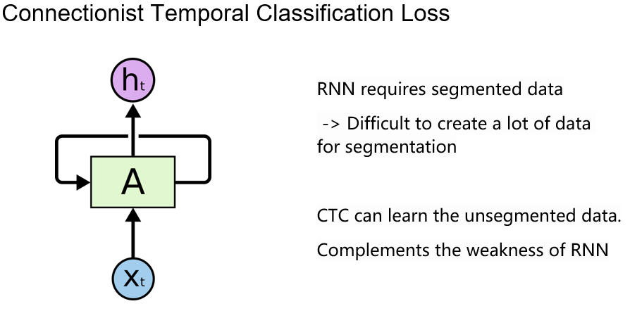
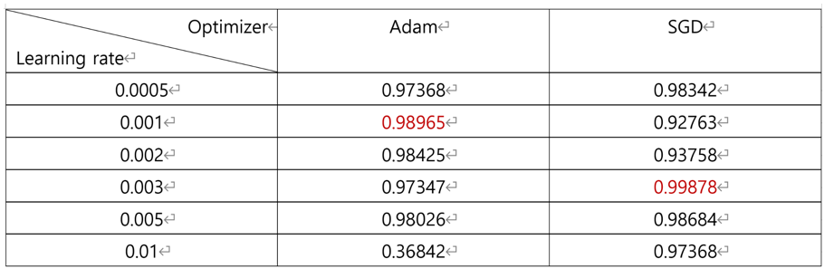

 

* People
  * Yeongjin Kim
  * Jaeho Lee
  * Chankyu Lee
  * Chaerin Ko
  * Seoyeon Choo
 

* Language / IDE
  * ML
    * Python
    * Google Colab (Pro ver. A100 GPU)
    * TensorFlow
    * Pandas
    * Scikit-learn
  * Chrome Extension
    * JavaScript
    * Visual Studio Code
  

* Dataset
  * 110000 images (Train : 99000, Test: 11000)

  
  
  

  

* Model
  * OCR(Conv-pool-Conv-pool-bidirectional-bidirectional)
 

  
  
  
  

  

* Optimizer
  * He
  * Adam
  * Lr = 0.001
  * 64 Batch
  * 200 Epoch

  

* Result

 
