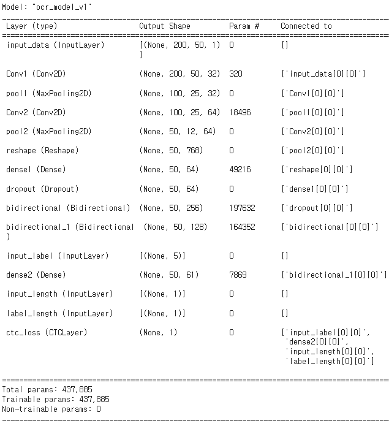

 

* YouTube

 

* People
  * [Yeongjin Kim](https://github.com/kyj950514 "김영진")
  * [Jaeho Lee](https://github.com/Jaeho-99 "이재호")
  * [Chankyu Lee](https://github.com/poco7250 "이찬규")
  * [Chaelin Ko](https://github.com/chaelin2 "고채린")
  * [Seoyeon Choo](https://github.com/ChooSeoyeon "추서연")
   

* Language / IDE
  * ML
    * 
    * 
    * 
    * 
    * 
  * Chrome Extension
    * 
    * 
  

* Dataset
  * 110000 images (Train : 99000, Test: 11000)

  
  
  

   

* Model
  * OCR (Conv-pool-Conv-pool-bidirectional-bidirectional)
 

  
  
 

  

* Optimizer
  * Adam
  * Lr = 0.001
  * 64 Batch
  * 200 Epoch

  

* Result

 
